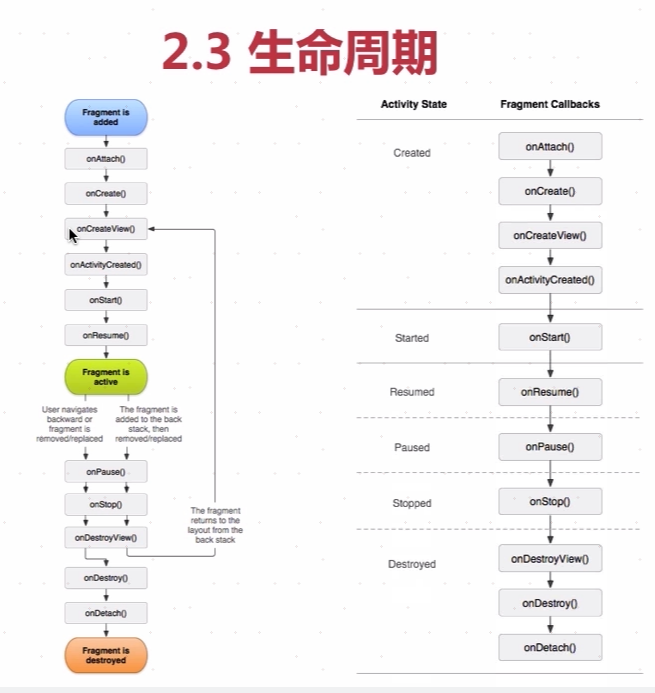
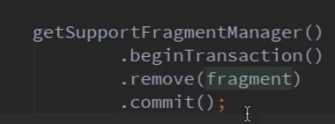

# 引入

建议用support包里的fragment，会不断更新，可以兼容到1.6

# 生命周期



**状态解析**

- **onAttach()**：Fragment和Activity相关联时调用。可以通过该方法获取Activity引用，还可以通过getArguments()获取参数。

- **onCreate()**：Fragment被创建时调用。

- **onCreateView()**：创建Fragment的布局。

- **onActivityCreated()**：当Activity完成onCreate()时调用。

- **onStart()**：当Fragment可见时调用。

- **onResume()**：当Fragment可见且可交互时调用。

- **onPause()**：当Fragment不可交互但可见时调用。

- **onStop()**：当Fragment不可见时调用。

- **onDestroyView()**：当Fragment的UI从视图结构中移除时调用。

- **onDestroy()**：销毁Fragment时调用。

- **onDetach()**：当Fragment和Activity解除关联时调用

**场景解析**

- 当一个fragment被创建的时候，需调用以下生命周期方法：onAttach(),  onCreate(),  onCreateView(),  onActivityCreated()

- 当这个fragment对用户可见的时候，需调用：onStart() ,onResume()

- 当这个fragment进入后台模式需调用：onPause()，onStop()

- 当这个fragment被销毁或者是持有它的Activity被销毁了，调用：onPause() ,onStop(), onDestroyView(),  onDestroy()，onDetach()

# 使用

## method1 静态加载

以<fragment>标签的形式添加到Activity的布局当中。

```xml
<?xml version="1.0" encoding="utf-8"?>
<LinearLayout xmlns:android="http://schemas.android.com/apk/res/android"
    xmlns:app="http://schemas.android.com/apk/res-auto"
    xmlns:tools="http://schemas.android.com/tools"
    android:layout_width="match_parent"
    android:layout_height="match_parent"
    android:orientation="vertical" 		
    tools:context="com.example.wcystart.wcystart.FragmentActivity">
 
    <fragment
        android:id="@+id/first_fragment"
        android:name="com.example.wcystart.wcystart.FirstFragment"
        android:layout_width="match_parent"
        android:layout_height="wrap_content"
        android:layout_weight="1" />
 
    <fragment
        android:id="@+id/second_fragment"
        android:name="com.example.wcystart.wcystart.SecondFragment"
        android:layout_width="match_parent"
        android:layout_height="wrap_content"
        android:layout_weight="1" />
 
</LinearLayout>
```

## method2 动态加载

**FragmentManager**：用来管理Activity中的fragment

使用：

- app包中使用getFragmentManager() 
- v4包中getSupportFragmentManager()

**FragmentTransaction**：事务,用来添加，移除，替换fragment

使用：

```java
FragmentTransaction transaction = fm.benginTransatcion();//开启一个事务

transaction.add();//往Activity中添加一个Fragment

transaction.remove();//从Activity中移除一个Fragment，如果被移除的Fragment没有添加到回退栈，这个Fragment实例将会被销毁。

transaction.replace();//使用另一个Fragment替换当前的，实际上就是remove()然后add()的合体。

transaction.hide();//隐藏当前的Fragment，仅仅是设为不可见，并不会销毁。

transaction.show();//显示之前隐藏的Fragment。

transaction.commit();//提交一个事务。

transaction.detach();//会将view从UI中移除,和remove()不同,此时fragment的状态依然由FragmentManager维护。

transaction.attach();//重建view视图，附加到UI上并显示。
```

注意：

- 在用`Fragment`的时候，可能会经常遇到这样`Activity`状态不一致：State loss这样的错误。主要是因为：commit方法一定要在`Activity.onSaveInstance()`之前调用。

  - 比如：我在`FragmentA`中的`EditText`填了一些数据，当切换到`FragmentB`时，如果希望会到A还能看到数据，则适合你的就是hide和show；也就是说，希望保留用户操作的面板，你可以使用hide和show，当然了不要使劲在那new实例，进行下非null判断。

  - 再比如：我不希望保留用户操作，你可以使用remove()，然后add()；或者使用replace()这个和remove,add是相同的效果。

  - remove和detach有一点细微的区别，在不考虑回退栈的情况下，remove会销毁整个Fragment实例，而detach则只是销毁其视图结构，实例并不会被销毁。那么二者怎么取舍使用呢？如果你的当前Activity一直存在，那么在不希望保留用户操作的时候，你可以优先使用detach。

**示例**




# 通信

## ①fragment与fragment通信

不同的`fragment`，他们之间的通信要依靠`activity`来完成。我们可以把他看成Fragment->Activity->Fragment,因为两个乃至多个`fragment`是依附于同一个`activity`,所以完全可以通过把值传递到共同依附的`Activity`,然后通过`Bundle`传给另一个`fragment`。

### 方式一：先调用findFragmentById()方法根据id获得fragment的对象，然后调用fragment中的方法进行赋值.

Code：

```java
manager.findFragmentById(); //根据ID来找到对应的Fragment实例，主要用在静态添加fragment的布局中，因为静态添加的fragment才会有ID.

manager.findFragmentByTag();//根据TAG找到对应的Fragment实例，主要用于在动态添加的fragment中，根据TAG来找到fragment实例

manager.getFragments();//获取所有被add进Activity中的Fragment
```

注意：

- 直接在一个`Fragment`中调用另外一个`Fragment`的公开方法,前提是要先拿到另外一个`Fragment`的实例。

- 一般情况下，我们都是动态添加`Fragment`的，所以通过在add每个`Fragment`的时候，给每个`Fragment`设置个tag。

Example：

**①Activity**

```java
public class MainActivity extends FragmentActivity {
 
	private FragmentManager manager;
	private FragmentTransaction transaction;
	
	@Override
	protected void onCreate(Bundle savedInstanceState) {
		super.onCreate(savedInstanceState);
		setContentView(R.layout.activity_main);
		
		/*获取manager*/
		manager = this.getSupportFragmentManager();
		/*创建事物*/
		transaction = manager.beginTransaction();
		/*创建leftFragment*/
		LeftFragment leftFragment = new LeftFragment();
		/*创建RightFragment*/
		RightFragment rightFragment = new RightFragment();
		/*通过事物把两个fragment分别添加到对应的容器中*/
		transaction.add(R.id.left, leftFragment, "left");
		transaction.add(R.id.right, rightFragment, "right");
		/*提交事物*/
		transaction.commit();
	}
}
```

在`Activity`创建的时候，添加上所有的`fragment`,并为每个`fragment`设置tag，这样才会在每个`fragment`中通过`findFragmentByTag()`时，不会出现空指针。

**②LeftFragment**

```java
public class LeftFragment extends Fragment {
    private TextView mTvHome;
    private Button mBtn;
 
    @Nullable
    @Override
    public View onCreateView(LayoutInflater inflater, @Nullable ViewGroup container, @Nullable Bundle savedInstanceState) {
        View view = inflater.inflate(R.layout.fragment_home, null);
        mTvHome = view.findViewById(R.id.tv_home);
        mBtn = view.findViewById(R.id.btn_home);
        initView();
        return view;
    }
 
    private void initView() {
        Bundle bundle = this.getArguments();
        String home = bundle.getString("home");
        mTvHome.setText(home);
 
        mBtn.setOnClickListener(new View.OnClickListener() {
            @Override
            public void onClick(View v) {
                RightFragment rightFragment = (RightFragment) getActivity().getSupportFragmentManager().findFragmentByTag("right");
                if (rightFragment == null) return;
 
                rightFragment .setTextView("right !!!!!!!!!!!!!!!");
            }
        });
    }
}
```

**③RightFragment**

```java
public class RightFragment extends Fragment {
    private TextView mTvCommunity;
    @Nullable
    @Override
    public View onCreateView(LayoutInflater inflater, @Nullable ViewGroup container, @Nullable Bundle savedInstanceState) {
        View view = inflater.inflate(R.layout.fragment_community, null);
        mTvCommunity=view.findViewById(R.id.tv_community);
        initView();
        return view;
    }
 
    private void initView() {
        Bundle bundle = this.getArguments();
        String community = bundle.getString("community");
        mTvCommunity.setText(community);
    }
   
    public void setTextView(String str){
        mTvCommunity.setText(str);
    }
}
```

这种方式是两个fragment直接通信的。（不推荐使用）


### 方式二：通过接口回调的方法实现两个fragment之间的通信

举例，比如点击`MessageFragment`的Button按钮，给`CommunityFragment`中的TextView传递数据。

我们就需要在`MessageFragment`中定义接口，并定义回调的方法，该方法的参数中传一个String的字符串。接着让附属Activity实现这个接口，并重写回调方法，也就得到到传过来的数据，然后通过`findFragmentByTag()`的方法获取要传给的`CommunityFragment`的实例。

Step：

1. 在CommunityFragment中定义一个方法用来接收这个数据，然后用对象直接调用这个方法将参数传递给这个方法，就可以了。
2. 在MessageFragment中定义接口，并定义回调的方法，该方法的参数中传一个String的字符串

**①MessageFragment**

```java
public class MessageFragment extends Fragment {
    private TextView mTvMessage;
    MessageListener mListener;
 
    @Override
    public void onCreate(@Nullable Bundle savedInstanceState) {
        super.onCreate(savedInstanceState);
        //创建接口的子类对象
        //获取当前Fragment所属的Activity,因为Activity实现了MessageListener接口，所以是MessageListener的子类
        mListener= (MessageListener) getActivity();
    }
 
    @Nullable
    @Override
    public View onCreateView(LayoutInflater inflater, @Nullable ViewGroup container, @Nullable Bundle savedInstanceState) {
        View view = inflater.inflate(R.layout.fragment_message, null);
        mTvMessage = view.findViewById(R.id.tv_message);
        initView();
        mListener.sendMessage("来自：MessageFragment的消息");
        return view;
    }
 
    private void initView() {
        Bundle arguments = this.getArguments();
        String message = arguments.getString("message");
        mTvMessage.setText(message);
    }
 
 
    public interface MessageListener {
        void sendMessage(String message);
    }
}
```

**②AddFragmentActivity**

```java
public class AddFragmentActivity extends FragmentActivity implements MessageFragment.MessageListener{
    private FrameLayout mFrameLayout;
    private RadioGroup mRg;
    private RadioButton mRbHome;
    private RadioButton mRbCommunity;
    private RadioButton mRbMessage;
    private RadioButton mRbMe;
    private List<Fragment> mFragments = new ArrayList<>();
    private HomeFragment homeFragment;
    private CommunityFragment communityFragment;
    private MessageFragment messageFragment;
    private MeFragment meFragment;
    private FragmentManager mSupportFragmentManager;
    private FragmentTransaction mTransaction;
    private TextView mTvMain;
 
 
    @Override
    protected void onCreate(Bundle savedInstanceState) {
        super.onCreate(savedInstanceState);
        setContentView(R.layout.activity_fragment);
        mFrameLayout = findViewById(R.id.frameLayout);
        mRg = findViewById(R.id.rg_main);
        mRbHome = findViewById(R.id.rb_home);
        mRbCommunity = findViewById(R.id.rb_community);
        mRbMessage = findViewById(R.id.rb_message);
        mRbMe = findViewById(R.id.rb_me);
        mTvMain=findViewById(R.id.tv_main);
        initView();
    }
 
    private void initView() {
        mSupportFragmentManager = getSupportFragmentManager();
        mTransaction = mSupportFragmentManager.beginTransaction();
        //设置默认选中首页
        mRg.check(R.id.rb_home);
        homeFragment = new HomeFragment();
        //创建Bundle对象，并存储数据
        Bundle bundle=new Bundle();
        bundle.putString("home","Home");
        homeFragment.setArguments(bundle);
 
        mFragments.add(homeFragment);
        hideOthersFragment(homeFragment, true,"homefragment");
        mRg.setOnCheckedChangeListener(new RadioGroup.OnCheckedChangeListener() {
            @Override
            public void onCheckedChanged(RadioGroup group, int checkedId) {
                switch (checkedId) {
                    case R.id.rb_home: //首页
                        hideOthersFragment(homeFragment, false,"homefragment");
                        break;
                    case R.id.rb_community: //发现
                        if (communityFragment == null) {
                            communityFragment = new CommunityFragment();
                            Bundle bundle=new Bundle();
                            bundle.putString("community","Community");
                            communityFragment.setArguments(bundle);
                            mFragments.add(communityFragment);
                            hideOthersFragment(communityFragment, true,"communityfragment");
                        } else {
                            hideOthersFragment(communityFragment, false,"communityfragment");
                        }
                        communityFragment.sendMessage(new ICommuntyCallBack() {
                            @Override
                            public void getMessageFromCommunty(String community) {
                                mTvMain.setText(community);
                            }
                        });
                        break;
                    case R.id.rb_message: //信息
                        if (messageFragment == null) {
                            messageFragment = new MessageFragment();
                            Bundle bundle=new Bundle();
                            bundle.putString("message","Message");
                            messageFragment.setArguments(bundle);
                            mFragments.add(messageFragment);
                            hideOthersFragment(messageFragment, true,"messagefragment");
                        } else {
                            hideOthersFragment(messageFragment, false,"messagefragment");
                        }
                        break;
                    case R.id.rb_me: //我的
                        if (meFragment == null) {
                            meFragment = new MeFragment();
                            Bundle bundle=new Bundle();
                            bundle.putString("me","Me");
                            meFragment.setArguments(bundle);
                            mFragments.add(meFragment);
                            hideOthersFragment(meFragment, true,"mefragment");
                        } else {
                            hideOthersFragment(meFragment, false,"mefragment");
                        }
                        meFragment.sendMessage(new IMeCallBack() {
                            @Override
                            public void getMessageFromMe(String me) {
                                mTvMain.setText(me);
                            }
                        });
                        break;
                }
            }
        });
    }
 
    private void hideOthersFragment(Fragment showFragment, boolean add,String tag) {
        mTransaction = mSupportFragmentManager.beginTransaction();
        if (add) {
            mTransaction.add(R.id.frameLayout, showFragment,tag);
        }
 
        for (Fragment fragment : mFragments) {
            if (showFragment.equals(fragment)) {
                mTransaction.show(fragment);
            } else {
                mTransaction.hide(fragment);
            }
        }
        mTransaction.commit();
    }
 
    @Override
    public void sendMessage(String message) {
        mTvMain.setText(message);
        CommunityFragment communityfragment = (CommunityFragment) 
        mSupportFragmentManager.findFragmentByTag("communityfragment");
        communityfragment.setTextView(message);
    }
```

在CommunityFragment中定义一个方法用来接收数据

**③CommunityFragment**

```java
 
public class CommunityFragment extends Fragment {
    private TextView mTvCommunity;
    public static final String TAG = "CommunityFragment";
 
    @Nullable
    @Override
    public View onCreateView(LayoutInflater inflater, @Nullable ViewGroup container, @Nullable Bundle savedInstanceState) {
        View view = inflater.inflate(R.layout.fragment_community, null);
        mTvCommunity = view.findViewById(R.id.tv_community);
        initView();
        return view;
    }
 
    private void initView() {
        Bundle bundle = this.getArguments();
        String community = bundle.getString("community");
       // mTvCommunity.setText(community);
    }
 
    public void setTextView(String str) {
        //System.out.println("来自HomeFragment传过来的消息" + str + "//");
        // mTvCommunity.setText(str);
        //if (str == null) return;
       mTvCommunity.setText(str);
    }
}
```

这样就实现了两个fragment之间的通信。

接口是我们常用的Fragment之间的通讯方式，通过一个主Activity作为通讯桥梁（谷歌官方声明：两个Fragment之间永远不要直接通讯），实现两个Fragment之间的通讯。

接口的方式是我们推荐的，但是，传统的接口方式会造成一些问题，如果主Activity实现了多个Fragment的通讯回调接口，那我们需要implements很多的接口，类中还要实现一大堆接口的方法，显得有点繁琐。


### 方式三：使用EventBus

EventBus：使用方便，但其使用的是反射原理，会有稍微的延迟，并且他人维护不方便；

static静态变量：使用方便，但是，每个static变量都会占用一块内存区，Android系统分配给每个App的内存是有限的（63M），过多很容易造成App内存溢出；


### 方式四：广播

广播Broadcast Receiver：Android的广播是有限制的，除了系统的广播外，其他的广播尽量少用。另外，广播会有延迟；


## ②Activity向Fragment传值

原理：

- 在`activity`中建一个`bundle`，把要传的值存入`bundle`，然后通过`fragment`的`setArguments`（bundle）传到`fragment`，在`fragment`中，用`getArguments`接收。

就动态添加fragment的例子，在添加每个fragment之前，使用Bundle传输数据给每个fragment。

**①Activity**

```java
 private void initView() {
        mSupportFragmentManager = getSupportFragmentManager();
        mTransaction = mSupportFragmentManager.beginTransaction();
        //设置默认选中首页
        mRg.check(R.id.rb_home);
        homeFragment = new HomeFragment();
        //创建Bundle对象，并存储数据
        Bundle bundle=new Bundle();
        bundle.putString("home","Home");
        homeFragment.setArguments(bundle);
        mFragments.add(homeFragment);
        hideOthersFragment(homeFragment, true);
        mRg.setOnCheckedChangeListener(new RadioGroup.OnCheckedChangeListener() {
            @Override
            public void onCheckedChanged(RadioGroup group, int checkedId) {
                switch (checkedId) {
                    case R.id.rb_home: //首页
                        hideOthersFragment(homeFragment, false);
                        break;
                    case R.id.rb_community: //发现
                        if (communityFragment == null) {
                            communityFragment = new CommunityFragment();
                            Bundle bundle=new Bundle();
                            bundle.putString("community","Community");
                            communityFragment.setArguments(bundle);
                            mFragments.add(communityFragment);
                            hideOthersFragment(communityFragment, true);
                        } else {
                            hideOthersFragment(communityFragment, false);
                        }
                        break;
                    case R.id.rb_message: //信息
                        if (messageFragment == null) {
                            messageFragment = new MessageFragment();
                            Bundle bundle=new Bundle();
                            bundle.putString("message","Message");
                            messageFragment.setArguments(bundle);
                            mFragments.add(messageFragment);
                            hideOthersFragment(messageFragment, true);
                        } else {
                            hideOthersFragment(messageFragment, false);
                        }
                        break;
                    case R.id.rb_me: //我的
                        if (meFragment == null) {
                            meFragment = new MeFragment();
                            Bundle bundle=new Bundle();
                            bundle.putString("me","Me");
                            meFragment.setArguments(bundle);
                            mFragments.add(meFragment);
                            hideOthersFragment(meFragment, true);
                        } else {
                            hideOthersFragment(meFragment, false);
                        }
                        break;
                }
            }
        });
    }
```

**②Fragment中**

```java
public class HomeFragment extends Fragment {
    private TextView mTvHome;
 
    @Nullable
    @Override
    public View onCreateView(LayoutInflater inflater, @Nullable ViewGroup container, @Nullable Bundle savedInstanceState) {
        View view = inflater.inflate(R.layout.fragment_home, null);
        mTvHome = view.findViewById(R.id.tv_home);
         initView();
        return view;
    }
 
    private void initView() {
        Bundle bundle = this.getArguments();
        String home = bundle.getString("home");
        mTvHome.setText(home);
    }
}
```


## ③Fragment向Activity传值

首先定义一个接口：

```java
public interface IHomeCallBack  {
    void getMessageFromHomeFragment(String home);
}
```

①接着在Fragment中设置接口回调的方法：

```java
public class HomeFragment extends Fragment {
    private TextView mTvHome;
 
    @Nullable
    @Override
    public View onCreateView(LayoutInflater inflater, @Nullable ViewGroup container, @Nullable Bundle savedInstanceState) {
        View view = inflater.inflate(R.layout.fragment_home, null);
        mTvHome = view.findViewById(R.id.tv_home);
        initView();
        return view;
    }
 
    private void initView() {
        Bundle bundle = this.getArguments();
        String home = bundle.getString("home");
        mTvHome.setText(home);
    }
    //设置接口回调方法
    public void sendMessage(IHomeCallBack iHomeCallBack){
        iHomeCallBack.getMessageFromHomeFragment("我是来自HomeFragment的消息");
    }
}
```

②最后在Activity中回调

```java
public class AddFragmentActivity extends FragmentActivity {
    private FrameLayout mFrameLayout;
    private RadioGroup mRg;
    private RadioButton mRbHome;
    private RadioButton mRbCommunity;
    private RadioButton mRbMessage;
    private RadioButton mRbMe;
    private List<Fragment> mFragments = new ArrayList<>();
    private HomeFragment homeFragment;
    private CommunityFragment communityFragment;
    private MessageFragment messageFragment;
    private MeFragment meFragment;
    private FragmentManager mSupportFragmentManager;
    private FragmentTransaction mTransaction;
    private TextView mTvMain;
 
    @Override
    protected void onCreate(Bundle savedInstanceState) {
        super.onCreate(savedInstanceState);
        setContentView(R.layout.activity_fragment);
        mFrameLayout = findViewById(R.id.frameLayout);
        mRg = findViewById(R.id.rg_main);
        mRbHome = findViewById(R.id.rb_home);
        mRbCommunity = findViewById(R.id.rb_community);
        mRbMessage = findViewById(R.id.rb_message);
        mRbMe = findViewById(R.id.rb_me);
        mTvMain=findViewById(R.id.tv_main);
        initView();
 
        initData();
    }
 
    private void initData() {
        homeFragment.sendMessage(new IHomeCallBack() {
            @Override
            public void getMessageFromHomeFragment(String home) {
                mTvMain.setText(home);
            }
        });
    }
 
    private void initView() {
        mSupportFragmentManager = getSupportFragmentManager();
        mTransaction = mSupportFragmentManager.beginTransaction();
        //设置默认选中首页
        mRg.check(R.id.rb_home);
        homeFragment = new HomeFragment();
        //创建Bundle对象，并存储数据
        Bundle bundle=new Bundle();
        bundle.putString("home","Home");
        homeFragment.setArguments(bundle);
        mFragments.add(homeFragment);
        hideOthersFragment(homeFragment, true);
        mRg.setOnCheckedChangeListener(new RadioGroup.OnCheckedChangeListener() {
            @Override
            public void onCheckedChanged(RadioGroup group, int checkedId) {
                switch (checkedId) {
                    case R.id.rb_home: //首页
                        hideOthersFragment(homeFragment, false);
                        break;
                    case R.id.rb_community: //发现
                        if (communityFragment == null) {
                            communityFragment = new CommunityFragment();
                            Bundle bundle=new Bundle();
                            bundle.putString("community","Community");
                            communityFragment.setArguments(bundle);
                            mFragments.add(communityFragment);
                            hideOthersFragment(communityFragment, true);
                        } else {
                            hideOthersFragment(communityFragment, false);
                        }
 
                        communityFragment.sendMessage(new ICommuntyCallBack() {
                            @Override
                            public void getMessageFromCommunty(String community) {
                                mTvMain.setText(community);
                            }
                        });
                        break;
                    case R.id.rb_message: //信息
                        if (messageFragment == null) {
                            messageFragment = new MessageFragment();
                            Bundle bundle=new Bundle();
                            bundle.putString("message","Message");
                            messageFragment.setArguments(bundle);
                            mFragments.add(messageFragment);
                            hideOthersFragment(messageFragment, true);
                        } else {
                            hideOthersFragment(messageFragment, false);
                        }
 
                        messageFragment.sendMessage(new IMessageCallBack() {
                            @Override
                            public void getMessageFromMessage(String message) {
                                mTvMain.setText(message);
                            }
                        });
                        break;
                    case R.id.rb_me: //我的
                        if (meFragment == null) {
                            meFragment = new MeFragment();
                            Bundle bundle=new Bundle();
                            bundle.putString("me","Me");
                            meFragment.setArguments(bundle);
                            mFragments.add(meFragment);
                            hideOthersFragment(meFragment, true);
                        } else {
                            hideOthersFragment(meFragment, false);
                        }
 
                        meFragment.sendMessage(new IMeCallBack() {
                            @Override
                            public void getMessageFromMe(String me) {
                                mTvMain.setText(me);
                            }
                        });
                        break;
                }
            }
        });
    }
 
    private void hideOthersFragment(Fragment showFragment, boolean add) {
        mTransaction = mSupportFragmentManager.beginTransaction();
        if (add) {
            mTransaction.add(R.id.frameLayout, showFragment);
        }
 
        for (Fragment fragment : mFragments) {
            if (showFragment.equals(fragment)) {
                mTransaction.show(fragment);
            } else {
                mTransaction.hide(fragment);
            }
        }
        mTransaction.commit();
    }
}
```

接口的回调还可以这么写：

```java
public class MessageFragment extends Fragment {
    private TextView mTvMessage;
    MessageListener mListener;
 
   @Override
    public void onAttach(Context context) {
        super.onAttach(context);
        //创建接口的子类对象
        //获取当前Fragment所属的Activity,因为Activity实现了MessageListener接口，所以是MessageListener的子类
        mListener= (MessageListener)context;
    }
 
    @Nullable
    @Override
    public View onCreateView(LayoutInflater inflater, @Nullable ViewGroup container, 
    @Nullable Bundle savedInstanceState) {
        View view = inflater.inflate(R.layout.fragment_message, null);
        mTvMessage = view.findViewById(R.id.tv_message);
        mListener.sendMessage("来自：MessageFragment的消息");
        return view;
    }
 
    public interface MessageListener {
        void sendMessage(String message);
    }
}
```

然后让`Fragment`依附的`activity`实现这个接口，然后重写`sendMessage()`方法，这样我们就可以把数据传过来了。

这种方案应该是既能达到Fragment复用，又能达到很好的可维护性，并且性能也是杠杠的，所以说推荐使用。


# 其它

## Fragment + ViewPager 懒加载

ViewPager：ViewPager是一个在Android平台上常用的视图容器，用于实现页面滑动切换效果。它允许用户通过左右滑动屏幕来浏览多个页面，类似于水平滚动的标签页或幻灯片展示。ViewPager通常与Fragment结合使用，每个页面都可以是一个独立的Fragment。

懒加载字面意思就是当需要的时候才会去加载，不需要就不要加载。

以前处理 Fragment 的懒加载，我们通常会在 Fragment 中处理 setUserVisibleHint + onHiddenChanged 这两个函数，而在 Androidx 模式下，我们可以使用 FragmentTransaction.setMaxLifecycle() 的方式来处理 Fragment 的懒加载。

fragment 生命周期：
onAttach -> onCreate -> onCreateView -> onViewCreated -> onActivityCreated -> onStart -> onResume

一般在 onCreate方法中接收 bundle 中的数据，在 onCreateView 创建 view初始化 布局。在 onActivityCreated或者 onResume做懒加载

### 传统模式

```kotlin
package com.zhaoyanjun.mode1

import android.os.Bundle
import androidx.fragment.app.Fragment
import android.view.LayoutInflater
import android.view.View
import android.view.ViewGroup

abstract class BaseFragment : Fragment() {
    /**
     * 用户是否可见
     */
    protected var mIsVisibleToUser = false

    /**
     * view是否创建
     */
    protected var mIsViewCreated = false

    /**
     * 是否是第一次加载
     */
    protected var mIsFirstLoad = false

    override fun onActivityCreated(savedInstanceState: Bundle?) {
        super.onActivityCreated(savedInstanceState)
        mIsViewCreated = true
        if (mIsVisibleToUser) {
            firstLoad()
        }
    }

    /**
     * 懒加载模式下生效
     */
    fun firstLoad() {
        if (mIsFirstLoad) {
            return
        }
        mIsFirstLoad = true
        onFirstLoad()
    }

    /**
     * 懒加载的时候调用
     */
    open fun onFirstLoad() {

    }

    override fun setUserVisibleHint(isVisibleToUser: Boolean) {
        super.setUserVisibleHint(isVisibleToUser)
        mIsVisibleToUser = isVisibleToUser
        if (mIsVisibleToUser && mIsViewCreated) {
            firstLoad()
        }
    }

    override fun onDestroyView() {
        mIsVisibleToUser = false
        mIsViewCreated = false
        mIsFirstLoad = false
        super.onDestroyView()
    }
}
```
使用 ：

```kotlin
package com.zhaoyanjun.mode1

import android.os.Bundle
import android.util.Log
import android.view.LayoutInflater
import android.view.View
import android.view.ViewGroup
import android.widget.TextView
import com.zhaoyanjun.R

class ContentFragment : BaseFragment() {
    private var param1: String? = null
    private var rootView: View? = null
    private var nameTv: TextView? = null

    override fun onCreate(savedInstanceState: Bundle?) {
        super.onCreate(savedInstanceState)
        arguments?.let {
            param1 = it.getString(ARG_PARAM1)
        }
    }

    override fun onCreateView(
        inflater: LayoutInflater, container: ViewGroup?,
        savedInstanceState: Bundle?
    ): View? {
        rootView = inflater.inflate(R.layout.fragment_content, container, false)
        nameTv = rootView?.findViewById(R.id.name)
        return rootView
    }

    //懒加载更新数据
    override fun onFirstLoad() {
        super.onFirstLoad()
        //第一次加载
        Log.d("zhaoyanjun-", "firstLoad index: $param1")
        nameTv?.text = param1
    }

    companion object {

        private const val ARG_PARAM1 = "param1"

        @JvmStatic
        fun newInstance(param1: String) =
            ContentFragment().apply {
                arguments = Bundle().apply {
                    putString(ARG_PARAM1, param1)
                }
            }
    }
}
```
### Androidx

在使用 Androidx 的时候，会发现 FragmentPagerAdapter(fragmentManager) 方法过时了

取而代之的是 两个参数的构造函数 。

```kotlin
public FragmentPagerAdapter(@NonNull FragmentManager fm,
            @Behavior int behavior) {
     mFragmentManager = fm;
     mBehavior = behavior;
}
```


mBehavior 有两个值：BEHAVIOR_SET_USER_VISIBLE_HINT 、BEHAVIOR_RESUME_ONLY_CURRENT_FRAGMENT 。 默认情况下使用的是 BEHAVIOR_SET_USER_VISIBLE_HINT

从官方的注释声明中，我们能得到如下两条结论：

- 如果 behavior 的值为 BEHAVIOR_SET_USER_VISIBLE_HINT，那么当 Fragment 对用户的可见状态发生改变时，setUserVisibleHint 方法会被调用。
- 如果 behavior 的值为 BEHAVIOR_RESUME_ONLY_CURRENT_FRAGMENT ，那么当前选中的 Fragment在 Lifecycle.State#RESUMED 状态 ，其他不可见的 Fragment 会被限制在Lifecycle.State#STARTED 状态。

所以我的的懒加载方案就呼之欲出了：


```kotlin
package com.zhaoyanjun.mode2

import androidx.fragment.app.Fragment

abstract class BaseFragment2 : Fragment() {
    private var isLoaded = false

    override fun onResume() {
        super.onResume()
        //增加了Fragment是否可见的判断
        if (!isLoaded && !isHidden) {
            isLoaded = true
            onFirstLoad()
        }
    }

    override fun onDestroyView() {
        super.onDestroyView()
        isLoaded = false
    }

    open fun onFirstLoad() {

    }
}
```
使用：

```kotlin
class ContentFragment2 : BaseFragment2() {
    private var param1: String? = null
    private var rootView: View? = null
    private var nameTv: TextView? = null

    override fun onCreate(savedInstanceState: Bundle?) {
        super.onCreate(savedInstanceState)
        arguments?.let {
            param1 = it.getString(ARG_PARAM1)
        }
    }

    override fun onCreateView(
        inflater: LayoutInflater, container: ViewGroup?,
        savedInstanceState: Bundle?
    ): View? {
        rootView = inflater.inflate(R.layout.fragment_content, container, false)
        nameTv = rootView?.findViewById(R.id.name)
        return rootView
    }

    override fun onFirstLoad() {
        super.onFirstLoad()
        //第一次加载
        Log.d("zhaoyanjun-mode2 ", "firstLoad index: $param1")
        nameTv?.text = param1
    }

    companion object {

        private const val ARG_PARAM1 = "param1"

        @JvmStatic
        fun newInstance(param1: String) =
            ContentFragment2().apply {
                arguments = Bundle().apply {
                    putString(ARG_PARAM1, param1)
                }
            }
    }
}
```
