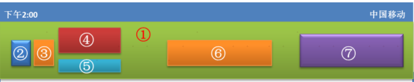

## 应用栏

toolbar的组成如下:

①为Toolbar整体，继承ViewGroup，是个容器控件，自己包含了①—⑥，而⑦是Activity中引入的；

②为导航按钮，类型为ImageButton，可设置点击事件，用于返回上个页面或者滑出侧滑菜单；

xml属性：app:navigationIcon="@drawable/xxx"//引入一张图标；

③为Logo展示图，类型为ImageView，不响应事件，仅仅作为展示。

xml属性：app:logo="@drawable/xxx"//引入一张图标；

④为主标题，类型为TextView；xml属性：app:title

⑤为副标题，类型为TextView；xml属性：app:subtitle

⑥为普通子View，标题和菜单之间是留给我们添加子View的区域；

⑦为菜单ActionMenuView，负责管理选项菜单，菜单本身可以点击。

注意：Toolbar控件在布局文件中可以2个图标，3段文字，只有第一个图标可设置点击事件，标题栏的这个位置最常用来放置返回按钮图标。